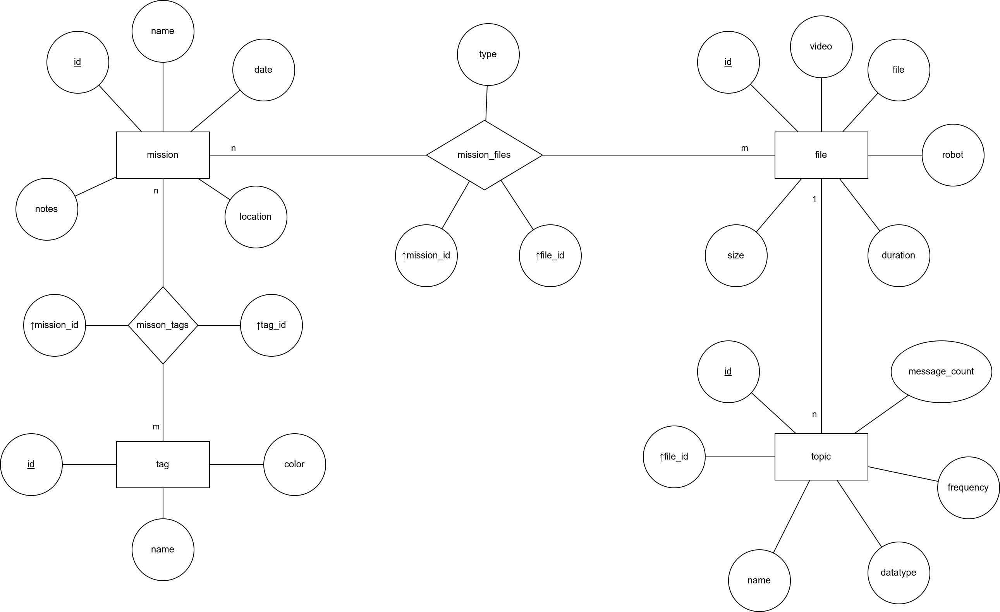

# Database Scheme #

The above diagram is an ER Diagram. Information on how to read those diagrams can be found [here](https://www.pertuniti.com/documentation/eer/).

The first table is the `missions` table. It has the columns `id`, `name`, `date`, `location` and `notes`.\
The `id` field is underlined which means it's the primary key and is an integer with auto increment.\
`name` is a string.\
`date` is a DateField.\
`location` and `notes` are strings and are optional.

The second table is the `files` table. It has the columns `id`, `file_path`, `robot`, `duration` and `size`.\
`id` is the primary key and is an integer with auto increment.\
`file_path` is a string that contains the absolute path to the actual file.\
`robot` is a string and contains the name of the used robot, can be optional.\
`duration` is an integer/biginteger and is the time in nanoseconds as in the metadata.yaml file.\
`size` is an integer/biginteger and is the size of the file in bytes.

To connect the entries of those two tables we need a relationship table. This is the `mission_files` table.\
It has the columns `mission_id`, `file_id` and `type`.\
`misson_id` and `file_id` are foreign keys and contain the primary keys of the entries in the other tables.\
`type` is used to indicate wether the file is used as train or test data and should be a string.

The third table is the `tags` table. It has the columns `id`, `name` and `color`.\
`name` is a string and is unique.\
`id` is the primary key and is an integer with auto increment.\
`color` is a Colorfield that stores the hex value of the colors and defaults to `#FFFFFF`. 

Again we need a relationship table to connect the tags and the missions. This is the `mission_tags` table.
It's only columns are `mission_id` and `tag_id` which are the foreign keys of the tables `missions` and `tags`.