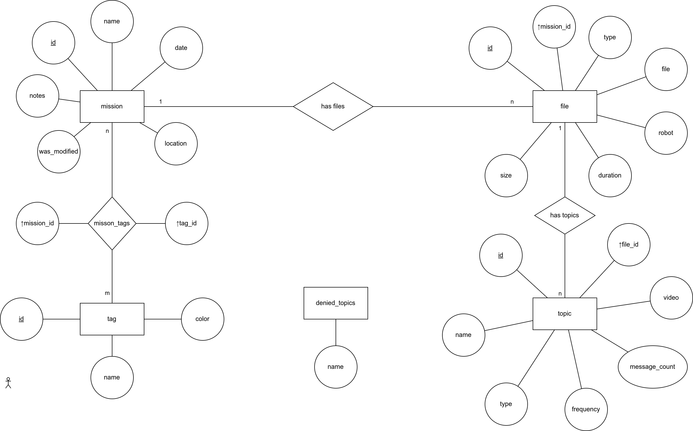

# Database Scheme #

The above diagram is an ER Diagram. Information on how to read those diagrams can be found [here](https://www.pertuniti.com/documentation/eer/).

The diamond shaped objects that don't have any bubbles around them are not tables, they are only used to put the relationship of the tables in words.

The first table is the `mission` table. It has the columns `id`, `name`, `date`, `location` and `notes`.
- The `id` field is underlined which means it's the primary key and is an integer with auto increment.
- `name` is a string.
- `date` is a DateField.
- `location` and `notes` are strings and are optional.

The second table is the `file` table. It has the columns `id`, `mission_id`, `file`, `robot`, `duration`, `size` and `type`.
- `id` is the primary key and is an integer with auto increment.
- `mission_id` is a foreign key that links a file to a mission.
- `file` is a FileField containing the actual file.
- `robot` is a string and contains the name of the used robot, can be optional.
- `duration` is an integer/biginteger and is the time in nanoseconds as in the metadata.yaml file.
- `size` is an integer/biginteger and is the size of the file in bytes.
- `type` is used to indicate wether the file is used as train or test data and is a string.

The third table is the `tag` table. It has the columns `id`, `name` and `color`.
- `name` is a string and is unique.
- `id` is the primary key and is an integer with auto increment.
- `color` is a Colorfield that stores the hex value of the colors and defaults to `#FFFFFF`. 

We need a relationship table to connect the tags and the missions. This is the `mission_tags` table.
It's only columns are `mission_id` and `tag_id` which are the foreign keys of the tables `mission` and `tag`

The fourth table is the `topic` table. It has the columns `id`, `file_id`, `name`, `datatype`, `message_count` and `frequency`
- `id` is the primary key
- `file_id` is a foreign key which contains a primary key of the `file` table
- `video` is a FileField containing the extracted video file.
- `name` is a string and the topic name
- `type` is a string and the topic type
- `message_count` is an integer and the number of messages in this topic
- `frequency` is a float and the frequency of messages. It can be calculated by dividing the `message_count` by the `duration` of the file in seconds and round it to 2 decimal places. It's unit is `Hz`

It's possible to explicitly deny topic names to be stored to the database with the `denied_topics`table.\
It has only the `name` field and contains topic names that should not be added to the database. All other topic names are allowed.